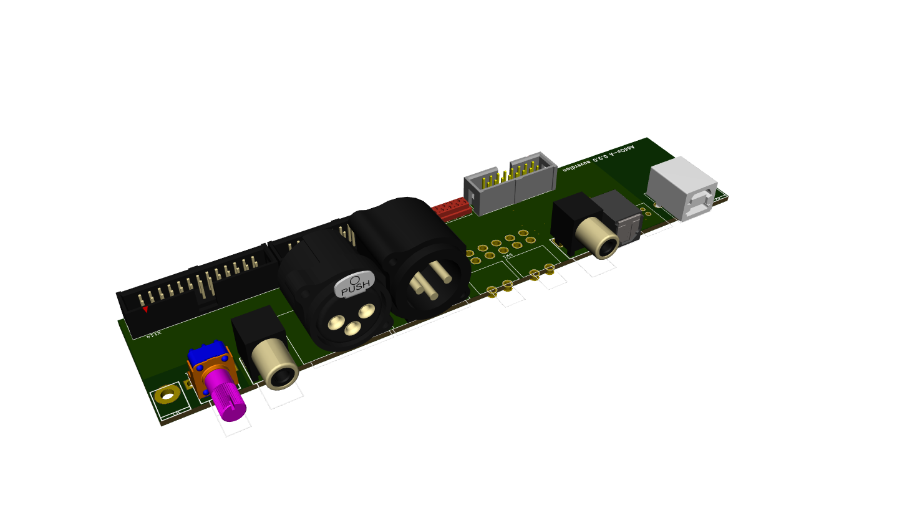
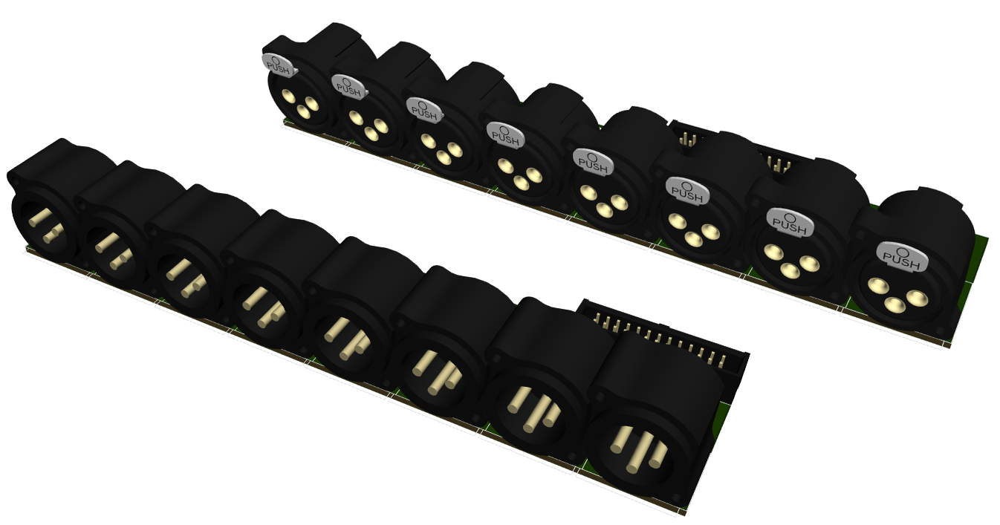

# Addons

## Add-On A: The woodworker’s friend

Perfect for an active loudspeaker 

- 1x XLR Analog in
- 1x RCA Analog in
- 1x TOSlink in (for S/P-DIF via glassfiber)
- 1x RCA Digital in (for S/P-DIF via coaxial cable)
- 1x RCA Digital out (connect a subwoofer)
- 1x XLR Analog Out (connect a subwoofer)
- 1x USB
- Volume potentiometer

### Links

* [Schematics and backplates v1.0.0](AddOnA%201.0.0/)
* [Schematics and backplates](AddOnA/)

## Add-On B: Down with developers

Pre-amp / 7.1-management without limits.

- 8x XLR Analog Out, unbalanced (RCA) is possible too
- 8x RCA Analog In
- 8x XLR Analog In
- 4x RCA Digital In (for S/P-DIF via Cinch)
- 4x TOSlink Digital In ((for S/P-DIF via LWL)
- 1x USB in

All digital inputs are up for multiplexing

### Links

* [Schematics and backplates](AddOnB/)

## Add-On C: For those who love to take control over the crowd

Loudspeaker management system for your next gig.

- 8x XLR Analog Out
- 4x XLR Analog In, two ADCs parallel for a much better SNR
- 1x TOSlink in
- 1x TOSlink out
- 1x XLR Digital In AES/EBU
- 1x XLR Digital Out AES/EBU
- 1x USB

All TOSlink can be used with ADAT or S/P-DIF.

### Links

* [Schematics and backplates](AddOnC/)

## Add-On D: Balanced Life

* 8x XLR analog input (balanced)
* 8x XLR analog output (balanced)

### Links

* [Schematics and backplates](AddOnD/)
